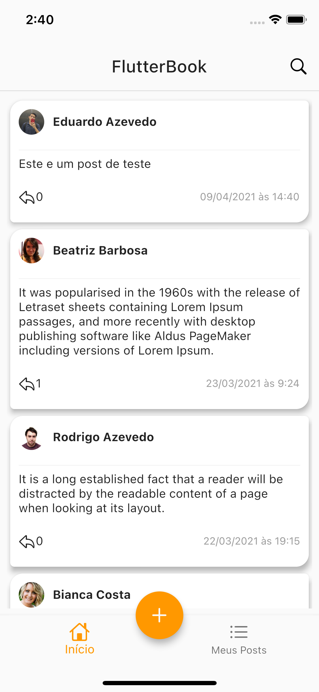
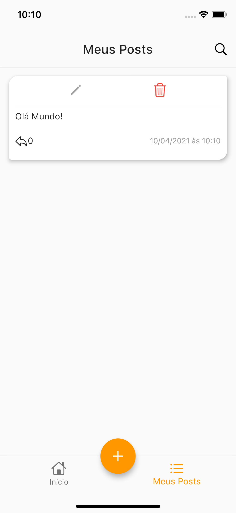
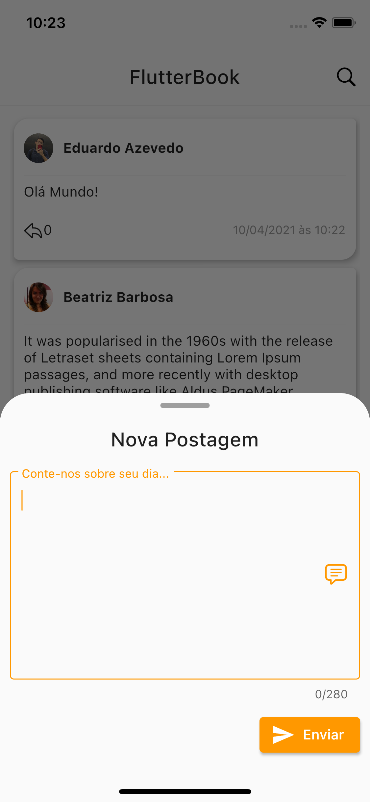
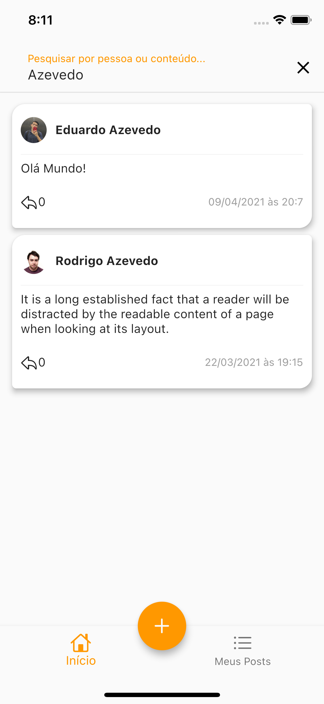
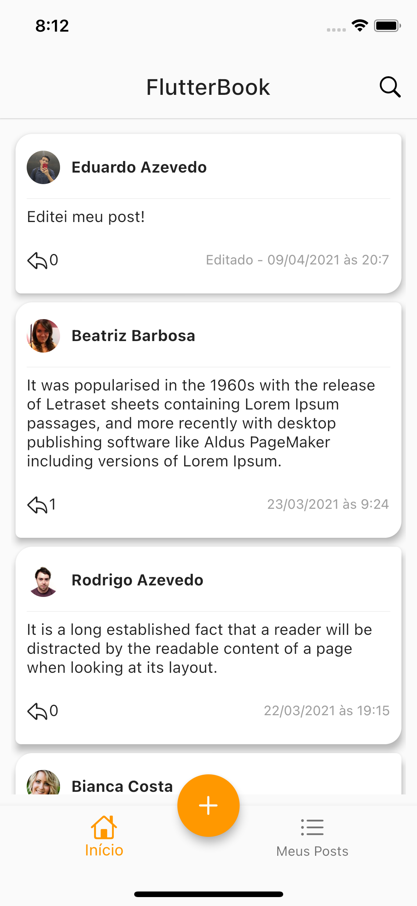

# Flutter Book

Aplicativo de "Blogging". Desafio proposto pela empresa Ephron - Convergência Organizacional.

## Tecnologias Utilizadas

A aplicação foi desenvolvida utilizando flutter e adotando padrões de código limpo, seguindo a arquitetura MVC (Model View Controller) com GetX, obtendo dados de uma API RESTful utlizando a biblioteca Dio.

## Funcionalidades

    -   listagem, criação, edição e exclusão de posts;
    -   busca de pessoa e/ou post utilizando a barra de pesquisa;

## Capturas de Tela

	
    
    
    
    
    
    
    
    

