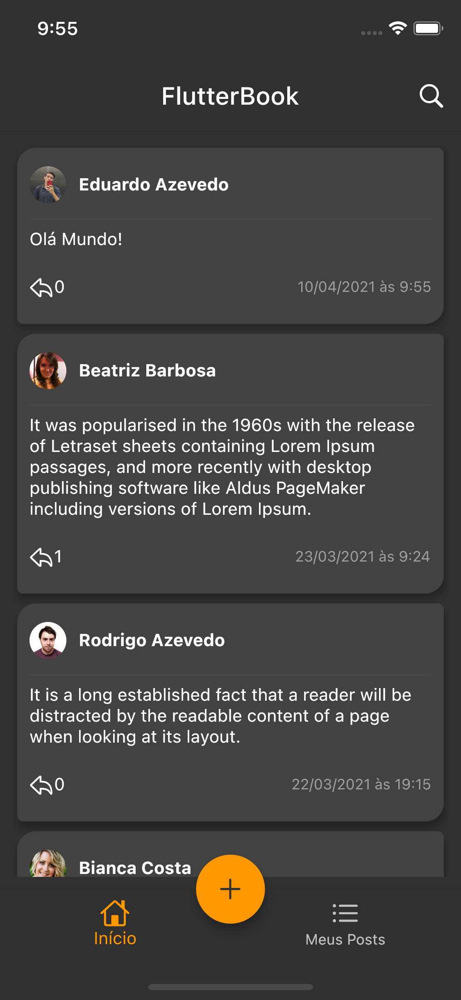

# FlutterBook

Aplicativo de "Blogging". Desafio proposto pela empresa Ephrom - Convergência Organizacional.

## Tecnologias Utilizadas

A aplicação foi desenvolvida utilizando flutter e adotando padrões de código limpo, seguindo a arquitetura MVC (Model View Controller) com GetX para controle de estado e injeção de dependencias, obtendo dados de uma API RESTful utlizando a biblioteca Dio, e utilizando Mockito para testes automatizados.

## Funcionalidades

    -   listagem, criação, edição e exclusão de posts;
    -   busca de post por pessoa e/ou conteúdo utilizando a barra de pesquisa;
    -   alteração de tema de acordo com o sistema (claro/escuro);

## Capturas de Tela

	
    
    
    
    

    
    
    
    
    

